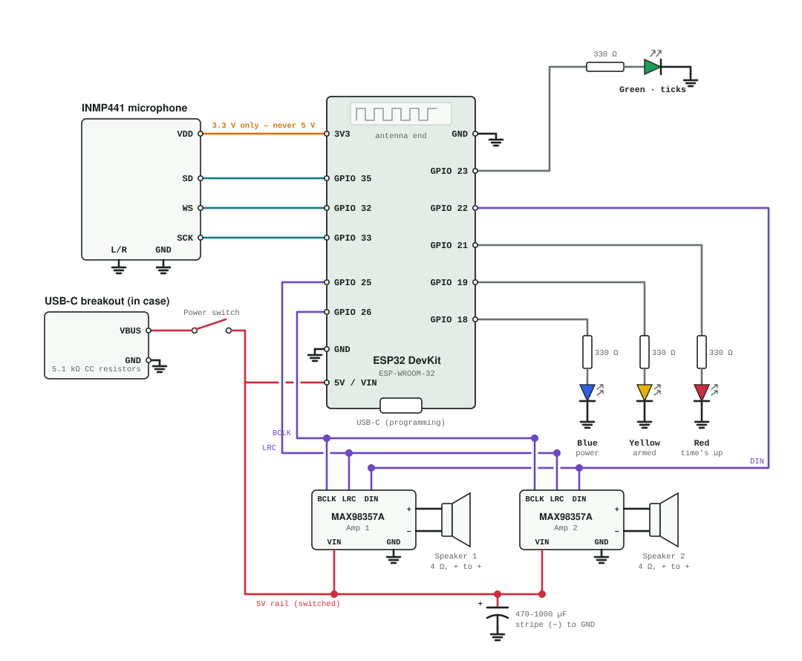

# ⚾ Baseball Timer

A small ESP32 device that hears the crack of the bat and starts a countdown. When a hit is detected, it counts down a time you choose, can tick along the way, and plays a "go" tone when time is up. Everything is set from your phone: scan the QR code on the case, and the control page opens on its own. No app to install.

<!-- Add a photo of the finished device here:

-->

## Features

- **Hit detection** from a digital microphone. A bat hit, a ball in a glove, or a clap starts the timer. Sensitivity is adjustable, and a live sound-level graph helps you tune it.
- **Countdown timer** from 0.1 seconds to 1 hour.
- **Countdown ticks** every 0.15, 0.25, 0.5, or 1 second, for the whole countdown or only the last 3 or 5 seconds. The last tick always lands one interval before the end.
- **End sounds:** a high "go" tone, triple beep, ding-dong, long tone, or single beep.
- **Four status LEDs:** blue for power, yellow pulsing while armed, green flashing with each tick, red when time is up.
- **Armed / disarmed modes**, switched from the phone or the button on the board.
- **Phone control over the device's own Wi-Fi.** It works anywhere, with no internet or router needed.
- **Settings are saved** on the device and kept through power cycles, so once it's set up you don't need the phone.

## How it works

1. Power it on. It plays a beep, runs a quick LED test, and waits **disarmed**.
2. Arm it from the phone, or press the **BOOT** button on the ESP32. The yellow LED starts pulsing.
3. A hit starts the countdown. Green flashes with each tick.
4. At zero, the end tone plays and red lights up. The device goes back to listening for the next hit.

Hits during a countdown are ignored. Disarming cancels a countdown in progress.

## Parts

Parts for one device cost roughly $25–35. Most parts come in multipacks, so a first order costs more but leaves spares. The core parts are:

- ESP32 dev board (ESP-WROOM-32, 30- or 38-pin)
- INMP441 I2S microphone
- One or two MAX98357A I2S amplifiers with 4 Ω 3 W speakers
- Four LEDs (blue, yellow, red, green) and four 330 Ω resistors
- 470–1000 µF capacitor
- USB-C power breakout (with 5.1 kΩ CC resistors) and a power switch

The full list with example links is in [`hardware/BOM.md`](hardware/BOM.md).

## Wiring



Wire colors: red = 5 V (switched), orange = 3.3 V, black = ground, teal = microphone, purple = amplifier signals (shared by both amps), gray = LED signals. A dot means wires connect.

| Part | Pin | ESP32 pin |
|---|---|---|
| INMP441 mic | VDD | **3V3** (never 5 V) |
| | SCK / WS / SD | GPIO 33 / GPIO 32 / GPIO 35 |
| | L/R, GND | GND |
| MAX98357A amp(s) | BCLK / LRC / DIN | GPIO 26 / GPIO 25 / GPIO 22 |
| | VIN / GND | 5 V rail / GND |
| | SD, GAIN | Not connected (GAIN to GND = louder; see BOM) |
| LEDs (each through 330 Ω) | Blue / Yellow / Red / Green | GPIO 18 / GPIO 19 / GPIO 21 / GPIO 23 |
| USB-C breakout | VBUS | Power switch → ESP32 5V (VIN on 30-pin boards) and amp VIN |
| | GND | GND |
| Capacitor | + / stripe (−) | 5 V rail / GND |

Notes:

- **Pin order varies between boards.** Go by the labels printed on yours. On 30-pin boards, 5 V is labeled **VIN** and GPIO pins are labeled **D18**, **D19**, and so on.
- **Second amp:** wire it exactly like the first, connected to the same three signal pins. Give each amp its own speaker, and wire both speakers the same way (+ to +). A reversed speaker partly cancels the other one out.
- **Never connect a speaker wire to ground.** The amp's outputs are bridged.
- **When programming,** turn the case power switch off while the board's own USB port is plugged into your computer, so the two power sources never meet.

## Installing the firmware

The firmware uses only libraries that come with the ESP32 board package. There is nothing extra to install.

1. Install the [Arduino IDE](https://www.arduino.cc/en/software).
2. In **Tools → Board → Boards Manager**, install **esp32 by Espressif Systems**, version 3.0 or newer.
3. Open [`firmware/baseball_timer/baseball_timer.ino`](firmware/baseball_timer/). The web page code opens with it in a second tab, `page.h`. Keep both files together in the `baseball_timer` folder.
4. Select **Tools → Board → ESP32 Dev Module** and your board's port, then click **Upload**.
5. Open the Serial Monitor at **115200** baud and press the board's **EN** button to restart it. You should see the settings, the mic channel it detected, and `Hotspot 'Baseball Timer' started`.

If an upload fails with "Failed to connect", hold the **BOOT** button while the upload starts.

## Using it

**Connect your phone:** scan the QR code on the case, or join the Wi-Fi network **Baseball Timer** (no password). The control page opens automatically. If it doesn't, open **http://192.168.4.1**.

- On **iPhone**, the page opens in a small sign-in window. If you close it, choose **Use Without Internet** to stay connected.
- On **Android**, tap the **Sign in to network** notification if the page doesn't open by itself, and choose to stay connected if it warns about no internet.

**On the control page:**

| Setting | What it does |
|---|---|
| Arm / disarm button | Turns hit detection on or off |
| Timer | Countdown length in seconds; whether to chirp when a hit starts it |
| Countdown ticks | Off, whole countdown, last 3 s, or last 5 s; every 0.15, 0.25, 0.5, or 1 s |
| End sound | The sound at zero, with a Test button |
| Lights | Red stays on until the next hit, or for 3 seconds; overall LED brightness |
| When powered on | Start disarmed (default) or armed |
| Volume, Sensitivity | Speaker volume; how sharp a sound must be to count as a hit |
| Mic level graph | Live sound level, background level, and the trigger line, for tuning sensitivity |

**Status LEDs:**

| LED | Meaning |
|---|---|
| Blue | On while running. Blinking fast means the mic or speaker failed to start. |
| Yellow | Slow pulse while armed. Off when disarmed. |
| Green | Flashes with each tick, with a dim glow between ticks. Solid during the countdown if ticks are off. |
| Red | Time's up. |

At power-up the LEDs light in order (blue, yellow, green, red) as a wiring check.

## Tuning hit detection

Open the control page while disarmed and watch the graph. The blue line is the live level, gray is the background, and the dashed red line is the trigger point. Make a few test hits:

- **False triggers** from talking or bumps: lower **Sensitivity**, which raises the red line.
- **Missed hits:** raise **Sensitivity**.

The Serial Monitor shows how far each hit rose above the background, which tells you how much margin you have. The device ignores its own sounds, so its beeps and ticks never count as hits.

## Making it louder

Roughly in order of effort:

1. **Raise the tone pitches** in `playSound()`. Small speakers are much louder around 2–3 kHz than at the default 660–1320 Hz.
2. **Increase amp gain:** GAIN pin to GND (12 dB) or through 100 kΩ to GND (15 dB, the maximum).
3. **Mount the speakers sealed against the inside of the case** behind a grid of holes. A bare speaker loses much of its output.
4. **Add the second amp and speaker.**

## Customizing

The firmware is commented throughout, and the top of `baseball_timer.ino` has a guide to where common settings live:

- Wi-Fi name and password: `AP_SSID`, `AP_PASS`. If you change either, generate a new QR code.
- Pin assignments, LED color balance, pulse speed, and hit-detection tuning: constants near the top
- What each sound sounds like: `playSound()`
- Default settings for a new board: `loadSettings()`
- The control page: `page.h`

## Troubleshooting

| Symptom | Check |
|---|---|
| `MIC: all zeros` in the Serial Monitor, or blue LED blinking fast | Mic wiring: VDD on 3V3, L/R to GND, SD/SCK/WS on the right pins |
| Mic level flat near −100 dB | Try swapping the SCK and WS wires |
| No sound, but no errors | BCLK and LRC swapped; speaker on the amp's + and − terminals |
| Board resets when a loud sound plays | Power: use a 2 A charger, add the capacitor, or lower the volume |
| `ESP_I2S.h: No such file` | Update the ESP32 board package to 3.0 or newer |
| Phone leaves the Wi-Fi network | Tell the phone to stay connected without internet |
| An LED stays dark during the startup test | LED reversed (long leg toward the resistor) or on the wrong pin |

## Repository layout

```
firmware/baseball_timer/   Arduino sketch: baseball_timer.ino + page.h (the control page)
hardware/wiring.svg        Wiring diagram
hardware/BOM.md            Parts list
hardware/qr/               Wi-Fi QR code for the case
hardware/case/             3D-printable case files
images/                    Photos for this README
```

## License

The firmware is released under the [MIT License](LICENSE). The case design and documentation are released under [CC BY-SA 4.0](https://creativecommons.org/licenses/by-sa/4.0/).
